```mermaid
sequenceDiagram
    box Grey Application
    participant Client
    participant Worker
    end
    box Grey Temporal Service
    participant Frontend
    participant Matcher
    participant History as History Shard
    end

    History->>History: start
    Worker->>Worker: start
    Client->>+Frontend: StartWorkflowExecution
    Frontend->>+History: StartWorkflowExecution
    History->>History: append [WorkflowExecutionStarted, WorkflowTaskScheduled]<br>create Transfer Task (Workflow Task)
    Note left of History: Transactional Outbox
    History-->>-Frontend: 
    Frontend-->>-Client: 
    loop QueueProcessor
        History->>History: read TransferTask
        Note left of History: Polling Publisher
        History->>+Matcher: AddWorkflowTask
        Matcher-->>-History: 
    end
    loop WorkflowPollTask
        Worker->>+Frontend: PollWorkflowTaskQueue
        Frontend->>+Matcher: PollWorkflowTaskQueue
        Matcher->>+History: RecordWorkflowTaskStarted
        History->>History: append [WorkflowTaskStarted]
        History-->>-Matcher: 
        Matcher-->>-Frontend: WorkflowTask
        Frontend->>+History: GetWorkflowExecutionHistory
        History-->>-Frontend: 
        Frontend-->>-Worker: WorkflowTask
        Worker->>Worker: handle WorkflowExecutionStarted
        Note right of Worker: ???
        Worker->>Worker: add workflow execution to cache
        Worker->>Worker: handle WorkflowTaskScheduled
        Note right of Worker: create WorkflowTaskStateMachine [CREATED]<br>execute Workflow transition [CREATED -> SCHEDULED]
        Worker->>Worker: execute Workflow function
        Note right of Worker: schedule activity task
        Worker->>Worker: handle ScheduleActivityTask
        Note right of Worker: create ActivityStateMachine [CREATED]<br>execute Activity transition [CREATED -> SCHEDULE_COMMAND_CREATED]
        Worker->>Worker: handle WorkflowTaskStarted
        Note right of Worker: execute Workflow transition [SCHEDULED -> STARTED]
        Worker->>+Frontend: RespondWorkflowTaskCompleted<br>[ScheduleActivityTask]
        Frontend->>+History: RespondWorkflowTaskCompleted<br>[ScheduleActivityTask]
        History->>History: append [WorkflowTaskCompleted, ActivityTaskScheduled]<br>create Transfer Task (Activity Task)
        Note left of History: Transactional Outbox
        History-->>-Frontend: 
        Frontend-->>-Worker: 
    end
    loop QueueProcessor
        History->>History: read TransferTask
        Note left of History: Polling Publisher
        History->>+Matcher: AddActivityTask
        Matcher-->>-History: 
    end
    loop ActivityPollTask
        Worker->>+Frontend: PollActivityTaskQueue
        Frontend->>+Matcher: PollActivityTaskQueue
        Matcher->>+History: RecordActivityTaskStarted
        History->>History: append [ActivityTaskStarted]
        History-->>-Matcher: 
        Matcher-->>-Frontend: ActivityTask
        Frontend-->>-Worker: ActivityTask
        Worker->>Worker: execute Activity function
        Worker->>+Frontend: RespondActivityTaskCompleted
        Frontend->>+History: RespondActivityTaskCompleted
        History->>History: append [ActivityTaskCompleted, WorkflowTaskScheduled]<br>create Transfer Task (Workflow Task)
        Note left of History: Transactional Outbox
        History-->>-Frontend: 
        Frontend-->>-Worker: 
    end
    loop QueueProcessor
        History->>History: read TransferTask
        Note left of History: Polling Publisher
        History->>+Matcher: AddWorkflowTask
        Matcher-->>-History: 
    end
    loop WorkflowPollTask
        Worker->>+Frontend: PollWorkflowTaskQueue
        Frontend->>+Matcher: PollWorkflowTaskQueue
        Matcher->>+History: RecordWorkflowTaskStarted
        History->>History: append [WorkflowTaskStarted]
        History-->>-Matcher: 
        Matcher-->>-Frontend: WorkflowTask
        Frontend->>+History: GetWorkflowExecutionHistory
        History-->>-Frontend: 
        Frontend-->>-Worker: WorkflowTask
        Worker->>Worker: handle WorkflowTaskCompleted
        Note right of Worker: execute Workflow transition [STARTED -> COMPLETED]
        Worker->>Worker: handle ActivityTaskScheduled
        Note right of Worker: execute Activity transition [SCHEDULE_COMMAND_CREATED -> SCHEDULED_EVENT_RECORDED]
        Worker->>Worker: handle ActivityTaskStarted
        Note right of Worker: execute Activity transition [SCHEDULED_EVENT_RECORDED -> STARTED]
        Worker->>Worker: handle ActivityTaskCompleted
        Note right of Worker: execute Activity transition [STARTED -> COMPLETED]
        Worker->>Worker: handle WorkflowTaskScheduled
        Note right of Worker: execute Workflow transition [CREATED -> SCHEDULED]
        Worker->>Worker: execute Workflow function
        Note right of Worker: schedule activity task
        Worker->>Worker: handle ScheduleActivityTask
        Note right of Worker: execute Activity transition [CREATED -> SCHEDULE_COMMAND_CREATED]
        Worker->>Worker: handle WorkflowTaskStarted
        Note right of Worker: execute Workflow transition [SCHEDULED -> STARTED]
        Worker->>+Frontend: RespondWorkflowTaskCompleted
        Frontend->>+History: RespondWorkflowTaskCompleted
        History->>History: append [WorkflowTaskCompleted, ActivityTaskScheduled]<br>create Transfer Task (Activity Task)
        Note left of History: Transactional Outbox
        History-->>-Frontend: 
        Frontend-->>-Worker: 
    end
    loop QueueProcessor
        History->>History: read TransferTask
        Note left of History: Polling Publisher
        History->>+Matcher: AddActivityTask
        Matcher-->>-History: 
    end
    loop ActivityPollTask
        Worker->>+Frontend: PollActivityTaskQueue
        Frontend->>+Matcher: PollActivityTaskQueue
        Matcher->>+History: RecordActivityTaskStarted
        History->>History: append [ActivityTaskStarted]
        History-->>-Matcher: 
        Matcher-->>-Frontend: ActivityTask
        Frontend-->>-Worker: ActivityTask
        Worker->>Worker: execute Activity function
        Worker->>+Frontend: RespondActivityTaskCompleted
        Frontend->>+History: RespondActivityTaskCompleted
        History->>History: append [ActivityTaskCompleted, WorkflowTaskScheduled]<br>create Transfer Task (Workflow Task)
        Note left of History: Transactional Outbox
        History-->>-Frontend: 
        Frontend-->>-Worker: 
    end
    loop QueueProcessor
        History->>History: read TransferTask
        Note left of History: Polling Publisher
        History->>+Matcher: AddWorkflowTask
        Matcher-->>-History: 
    end
    loop WorkflowPollTask
        Worker->>+Frontend: PollWorkflowTaskQueue
        Frontend->>+Matcher: PollWorkflowTaskQueue
        Matcher->>+History: RecordWorkflowTaskStarted
        History->>History: append [WorkflowTaskStarted]
        History-->>-Matcher: 
        Matcher-->>-Frontend: WorkflowTask
        Frontend->>+History: GetWorkflowExecutionHistory
        History-->>-Frontend: 
        Frontend-->>-Worker: WorkflowTask
        Worker->>Worker: handle WorkflowTaskCompleted
        Note right of Worker: execute Workflow transition [STARTED -> COMPLETED]
        Worker->>Worker: handle ActivityTaskScheduled
        Note right of Worker: execute Activity transition [SCHEDULE_COMMAND_CREATED -> SCHEDULED_EVENT_RECORDED]
        Worker->>Worker: handle ActivityTaskStarted
        Note right of Worker: execute Activity transition [SCHEDULED_EVENT_RECORDED -> STARTED]
        Worker->>Worker: handle ActivityTaskCompleted
        Note right of Worker: execute Activity transition [STARTED -> COMPLETED]
        Worker->>Worker: handle WorkflowTaskScheduled
        Note right of Worker: execute Workflow transition [CREATED -> SCHEDULED]
        Worker->>Worker: execute Workflow function
        Note right of Worker: complete workflow execution
        Worker->>Worker: handle CompleteWorkflowExecution
        Note right of Worker: execute CompleteWorkflow transition [CREATED -> COMPLETE_WORKFLOW_COMMAND_CREATED]
        Worker->>Worker: handle WorkflowTaskStarted
        Note right of Worker: execute Workflow transition [SCHEDULED -> STARTED]
        Worker->>Worker: evict workflow execution from cache
        Worker->>+Frontend: RespondWorkflowTaskCompleted<br>[CompleteWorkflowExecution]
        Frontend->>+History: RespondWorkflowTaskCompleted<br>[CompleteWorkflowExecution]
        History->>History: append [WorkflowTaskCompleted, WorkflowExecutionCompleted]<br>create Archival task
        Note left of History: Transactional Outbox
        History-->>-Frontend: 
        Frontend-->>-Worker: 
    end
```

#### Operations
- [StartWorkflowExecution](StartWorkflowExecution.md)
- [AddWorkflowTask](AddWorkflowTask.md)
- [PollWorkflowTaskQueue](PollWorkflowTaskQueue.md)
- [RecordWorkflowTaskStarted](RecordWorkflowTaskStarted.md)
- [GetWorkflowExecutionHistory](https://github.com/temporalio/temporal/blob/main/service/frontend/workflow_handler.go#L720)
- [RespondWorkflowTaskCompleted](RespondWorkflowTaskCompleted.md)
- [AddActivityTask](AddActivityTask.md)
- [PollActivityTaskQueue](PollActivityTaskQueue.md)
- [RecordActivityTaskStarted](RecordActivityTaskStarted.md)
- [RespondActivityTaskCompleted](RespondActivityTaskCompleted.md)
